# JavaScript Runner - 웹 기반 JS 코드 실행기


## 📑 목차
1. [목표와 기능](#1-목표와-기능)
2. [개발 환경 및 배포 URL](#2-개발-환경-및-배포-url)
3. [프로젝트 구조와 개발 일정](#3-프로젝트-구조와-개발-일정)
4. [팀 구성](#4-팀-구성)
5. [화면 설계](#5-화면-설계)
6. [메인 기능](#6-메인-기능)
7. [에러와 에러 해결](#7-에러와-에러-해결)
8. [개발하며 느낀점](#8-개발하며-느낀점)

---

## 1. 목표와 기능

### 1.1 목표
- 브라우저에서 즉시 실행 가능한 **경량 JavaScript 코드 실행 환경** 제공
- **Return 값**과 **Console.log 출력**을 분리하여 코드 실행 과정을 명확하게 시각화
- 실행 히스토리 관리 및 **텍스트 파일로 다운로드** 기능 제공

### 1.2 주요 기능
- ✅ **2가지 실행 모드 지원**
  - **개별 실행 모드**: 세미콜론(`;`) 기준으로 코드를 분리하여 각각의 결과 확인
  - **통합 실행 모드**: 전체 스크립트를 하나로 실행하여 변수 선언 및 로직 연결 지원
  
- ✅ **이중 출력 시스템**
  - **Return Value**: 함수 실행 결과값 표시
  - **Console Output**: `console.log()` 출력 내용 별도 표시
  
- ✅ **실행 히스토리 관리**
  - 입력 코드, 실행 결과, 콘솔 출력, 실행 모드 정보를 리스트로 저장
  - 최신 실행 내역이 상단에 표시되는 직관적인 UI
  
- ✅ **히스토리 다운로드**
  - 전체 실행 기록을 `.txt` 파일로 저장
  - 타임스탬프, 실행 모드, 코드, 결과를 포함한 상세 기록 제공
W

### 1.3 팀 구성
| 이름 | 역할 | 담당 |
|------|------|------|
| 강우석 | Frontend Developer | 기획, 디자인, 프론트엔드, 문서화 |

---

## 2. 개발 환경 및 배포 URL

### 2.1 개발 환경
**Front-End**
- HTML5
- CSS3 (CSS Variables, Flexbox)
- Vanilla JavaScript (ES6+)

**개발 도구**
- VS Code
- Git & GitHub

**주요 라이브러리**
- 외부 라이브러리 없이 순수 JavaScript로 구현

### 2.2 배포 URL
> 🔗 **GitHub Pages**: (https://usewooseok97.github.io/JS_simple_codeEditor/)

### 2.3 기능별 파일 구조
| 파일명 | 역할 | 주요 기능 |
|--------|------|----------|
| `index.html` | 메인 페이지 | 시맨틱 마크업, SEO 메타 태그, 접근성 준수 |
| `reset.css` | CSS 초기화 | 브라우저 기본 스타일 리셋, 접근성 유틸리티 클래스 |
| `main.css` | 메인 스타일 | CSS 변수, rem 단위, 반응형 디자인 |

---

## 3. 프로젝트 구조와 개발 일정

### 3.1 프로젝트 구조
```
📦 js_simple_codeEditor
 ┣ 📜 index.html          # 메인 HTML 파일
 ┣ 📜 reset.css           # CSS 리셋 및 접근성 스타일
 ┣ 📜 main.css            # 메인 스타일시트
 ┗ 📜 README.md           # 프로젝트 문서
```

### 3.2 개발 일정(WBS)

```mermaid
gantt
    title JS Runner 개발 일정
    dateFormat  YYYY-MM-DD
    section 기획
    요구사항 분석           :done, 2025-12-31, 1d
    
    section 설계
    UI/UX 설계             :done, 2025-12-31, 1d
    기능 명세 작성          :done, 2025-12-31, 1d
    
    section 개발
    HTML 구조 작성          :done, 2026-01-01, 1d
    CSS 스타일링           :done, 2026-01-01, 1d
    JavaScript 로직 구현    :done, 2026-01-01, 1d
    모드 전환 기능          :done, 2026-01-02, 1d
    히스토리 관리           :done, 2026-01-02, 1d
    
    section 테스트 & 배포
    기능 테스트            :done, 2026-01-02, 1d
    접근성 검증            :done, 2026-01-02, 1d
```



**일정 요약**
- **총 개발 기간**: 2025.12.31 ~ 2026.01.02 (3일)
- **주요 마일스톤**
  - Day 1 (12/31): 기획 및 UI 설계
  - Day 2 (01/01): 핵심 기능 구현
  - Day 3 (01/02): 고급 기능 및 마무리

---

## 4. 역할 분담
| 팀원 | 역할 | 구현 기능 |
|------|------|-----------|
| **강우석** | Frontend Developer | • 전체 기획 및 설계<br>• HTML/CSS 구조 설계<br>• JavaScript 로직 구현<br>• 접근성 및 SEO 최적화<br>• 문서화 |

---

## 5.  화면 설계

**메인 화면**
```
[메인 화면](./images/mainImg.png)

[결과 화면](./images/result.png)
```

**주요 UI 컴포넌트**
- **코드 입력 영역**: 모노스페이스 폰트, 1.5 line-height
- **모드 선택 체크박스**: 개별/통합 실행 모드 전환
- **결과 표시 영역**: Flexbox로 좌우 분할
- **히스토리 리스트**: 최신순 정렬, 카드 형태 UI

---

## 6. 메인 기능
### 6.1 메인기능 알고리즘
[결과 화면](./images/algorithum.png)

### 6.1 코드 실행 엔진

**핵심 로직**: `new Function()` 생성자 활용
```javascript
const executeLine = (codeLine) => {
  try {
    // 1차 시도: 표현식으로 실행 (return 자동 추가)
    return new Function("return " + codeLine)();
  } catch (e) {
    try {
      // 2차 시도: 문(statement)으로 실행
      return new Function(codeLine)();
    } catch (error) {
      return "Error";
    }
  }
};
```

**안전성**
- ❌ `eval()` 사용 금지 → 보안 취약점 방지
- ✅ `new Function()` 사용 → 전역 스코프에서만 실행

### 6.2 Console.log 가로채기 (Hooking)

**구현 원리**
```javascript
// 1. 원본 console.log 백업
const originalLog = console.log;
const logBuffer = [];

// 2. console.log를 커스텀 함수로 대체
console.log = (...args) => {
  const message = args.map(arg => String(arg)).join(' ');
  logBuffer.push(message);
};

// 3. 코드 실행 후 복구
try {
  executeCode(userCode);
} finally {
  console.log = originalLog; // 반드시 복구!
}
```

**장점**
- 사용자 코드의 `console.log()` 출력을 화면에 표시
- 브라우저 개발자 도구에 영향 없음

### 6.3 이중 실행 모드

#### 모드 1: 개별 실행 (Split Mode)
```javascript
// 입력 예시
typeof null; typeof 12;

// 실행 과정
code.split(';')  // → ["typeof null", " typeof 12"]
  .forEach(line => executeLine(line));

// 결과
Return Value:
object
number
```

**용도**: 단순 표현식 결과 확인 

#### 모드 2: 통합 실행 (Script Mode)
```javascript
// 입력 예시
let message = 'weniv';
message = message + ' loves you';
console.log(message);

// 실행 과정
new Function(code)(); // 전체를 하나의 함수로 실행

// 결과
Return Value: undefined
Console Output: weniv loves you
```

**용도**: 변수 선언 및 로직 연결이 필요한 스크립트

### 6.4 히스토리 관리 시스템

**데이터 구조**
```javascript
const historyData = [
  {
    timestamp: "2026-01-02 오후 3:45:12",
    code: "typeof null; typeof 12;",
    returnValue: "object\nnumber",
    consoleValue: "",
    mode: "☑️ 개별 실행 모드 (Split by ;)"
  }
];
```

**다운로드 형식** (`.txt`)
```
=== JavaScript Execution History ===

[Record #1 | 2026-01-02 오후 3:45:12]
--- Execution Mode ---
☑️ 개별 실행 모드 (Split by ;)
--- Input Code ---
typeof null; typeof 12;
--- Return Values ---
object
number
--- Console Output ---
(no log)

====================================
```

---

## 7. 에러와 에러 해결

### 7.1 `eval()` 사용 시 보안 문제
**문제**
```javascript
// ❌ 위험한 코드
eval(userInput); 
// XSS 공격 가능: document.cookie를 외부로 전송
```

**해결**
```javascript
// ✅ 안전한 코드
new Function(userInput)();
// 로컬 스코프 접근 불가, 전역 스코프에서만 실행
```

**참고 자료**: [Gemini 대화 - eval vs new Function](#자바스크립트-코드-실행-방법-비교)

### 7.2 `undefined.toString()` 에러
**문제**
```javascript
// console.log()는 undefined를 반환
const output = executeCode("console.log('test')").toString();
// ❌ TypeError: Cannot read properties of undefined
```

**해결**
```javascript
const rawOutput = executeCode(userCode);
const output = String(rawOutput); // String() 함수는 undefined 처리 가능
// ✅ "undefined" 문자열 반환
```

### 7.3 HTML 태그 입력 시 문법 에러
**문제**
```javascript
// 사용자 입력: <h1>hello</h1>
// ❌ SyntaxError: Unexpected token '<'
```

**해결**
```javascript
if (error instanceof SyntaxError && code.trim().startsWith("<")) {
  errorMessage = 'HTML 태그는 큰따옴표(")로 감싸야 합니다.';
}
```

**친절한 안내 메시지 제공**

### 7.4 변수 스코프 단절 문제
**문제**
```javascript
// 개별 실행 모드에서
let a = 10;  // 첫 번째 함수 실행 → 종료 후 a 사라짐
a + 5;       // 두 번째 함수 실행 → ReferenceError
```

**해결**
- **통합 실행 모드** 제공
- 체크박스로 모드 전환 가능

---

## 8. 개발하며 느낀점

### 8.1 학습

#### `eval()` vs `new Function()`
> "eval is evil" - Douglas Crockford

**배운 점**
- `eval()`은 현재 스코프에 접근하여 보안 위험이 큼
- `new Function()`은 전역 스코프에서만 실행되어 상대적으로 안전
- 그러나 사용자 입력을 실행하는 것 자체가 위험하므로, 실제 서비스에서는 샌드박스(Web Worker, iframe) 사용 필요

**참고 문서**
- [MDN - eval()](https://developer.mozilla.org/ko/docs/Web/JavaScript/Reference/Global_Objects/eval)
- [MDN - Function()](https://developer.mozilla.org/ko/docs/Web/JavaScript/Reference/Global_Objects/Function)

#### 에러 처리: `if` vs `try-catch`
**Before**
```javascript
if (typeof result === 'undefined') {
  // 에러 처리
}
```

**After**
```javascript
try {
  const result = executeCode(code);
} catch (error) {
  // 예외 처리
}
```

- 문법 에러, 런타임 에러는 `try-catch`로 처리하는 것이 더 명확
- `if`문은 예측 가능한 조건 분기에 사용
- `try-catch`는 예외 상황 처리에 사용

### 8.3 UX 개선의 중요성

**초기 설계**
- 단순히 코드 실행만 가능

**개선 과정**
1. Return Value와 Console Output 분리
2. 개별/통합 실행 모드 추가
3. 히스토리 관리 기능
4. 다운로드 기능

**배운 점**
- 사용자 입장에서 생각하면 더 나은 기능이 떠오름
- 작은 편의성 개선이 사용자 경험을 크게 향상시킴

---

## 자바스크립트 코드 실행 방법 비교

### Gemini와의 대화 요약

> 💬 **질문**: "사용자로부터 코드를 받아서 실행하고 결과를 반환하는 방법은?"

#### 1. `new Function()` (✅ 권장)
**장점**
- 전역 스코프에서만 실행되어 로컬 변수 접근 불가
- JS 엔진 최적화 가능
- `eval()`보다 안전

**사용법**
```javascript
const code = "return a + b;";
const fn = new Function('a', 'b', code);
const result = fn(10, 20); // 30
```

#### 2. `eval()` (❌ 비권장)
**단점**
- 현재 스코프 접근 가능 → 보안 취약
- 디버깅 어려움
- 성능 저하

**예시**
```javascript
const x = 10;
eval("x + 5"); // 15 (로컬 변수 x 접근)
```

#### 3. `vm` 모듈 (Node.js 환경)
**장점**
- 샌드박스 환경 제공
- 변수 접근 제한 가능

**사용법**
```javascript
const vm = require('vm');
const context = { a: 10, b: 20 };
vm.createContext(context);
const result = vm.runInContext('a + b', context);
```

### 보안 주의사항
⚠️ **XSS 공격 위험**
- 쿠키 탈취: `document.cookie` 전송
- 무한 루프: `while(true) {}`
- 악의적인 코드 실행

✅ **안전한 구현**
- Web Worker 사용 (메인 스레드 격리)
- iframe sandbox 속성 활용
- Content Security Policy (CSP) 설정

---

## 📄 라이센스
MIT License

## 🙏 감사의 말
이 프로젝트는 자바스크립트 학습 및 웹 표준 준수 연습을 목적으로 제작되었습니다.

---

**프로젝트 기간**: 2025.12.31 ~ 2026.01.02  
**개발자**: 강우석  
**문의**: [kwoos333@naver.com]